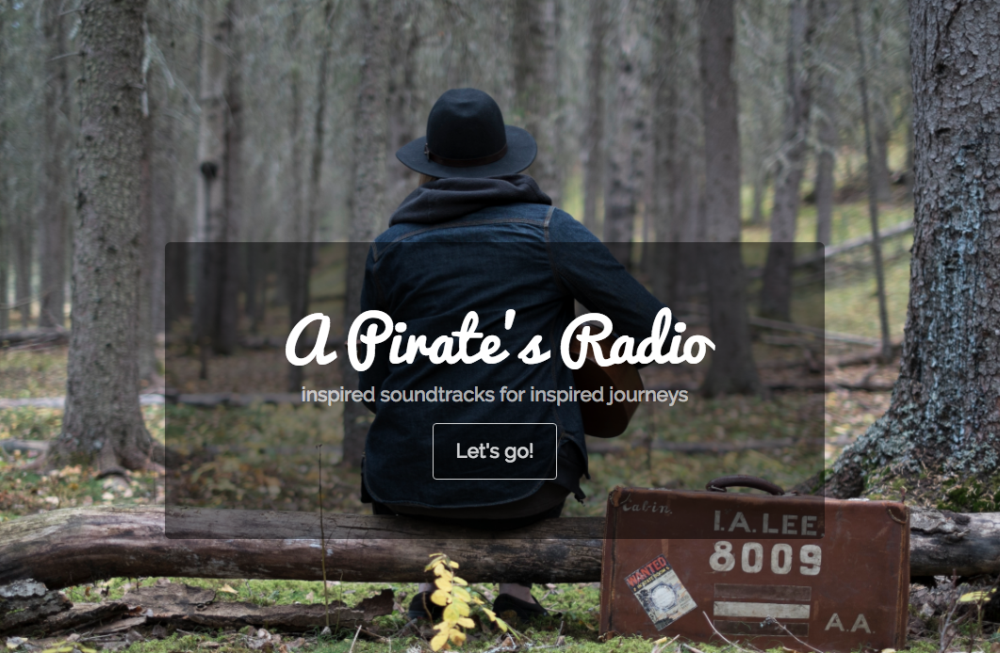
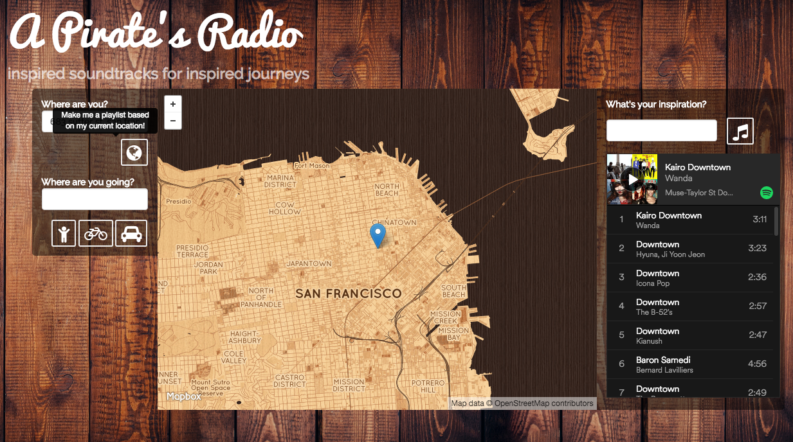
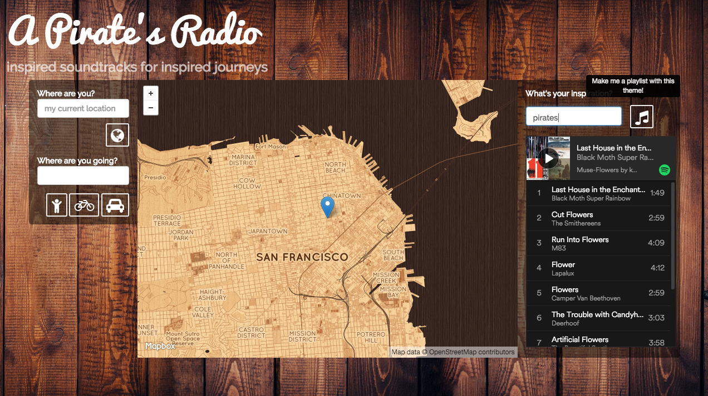
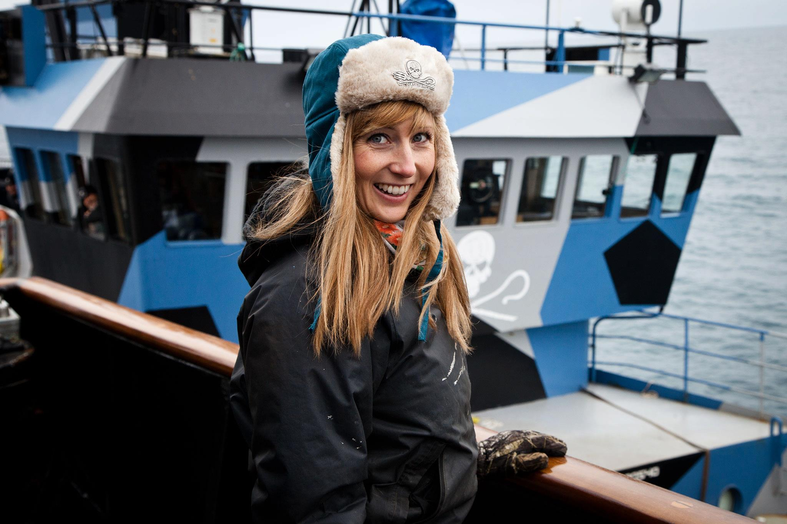

A Pirate's Radio
================

To learn about the pirate behind the radio: www.linkedin.com/in/kellyannhiggins

Every journey has a story, and in the nooks and crannies of every place hides hidden inspiration. The streets and neighborhoods around us have inspired stories immortalized in song. A Pirate's Radio features music about the place where you are, and the places you're going. A voyager can log in with their Spotify account, and with the click of a button have a playlist generated for them based on their current location, or a journey by car, bike, or foot. If you want to build your own custom playlist, the Pirate's Radio Muse will build you a playlist around any subject appearing in the lyrics. 

The playlists are saved to your Spotify account, and your personal Pirate's Radio is ready to be taken on any adventure you dare! 

A Pirate's Radio was built by Kelly Higgins, a former eco-pirate who lived aboard Sea Shepherd's flagship for four years, battling poachers from Antarctica, to the North Atlantic, to the South Pacific. A Pirate's Radio was inspired by the playlists Kelly and the crew would make while sailing the seas, trying to find songs about the islands and landmarks where their journeys took them. Kelly wanted to share that inspiration into people's everyday trips, to unlock a deeper appreciation of the places on our journeys, large and small.

## Table of Contents
* [Technologies Used](#technologiesused)
* [APIs Used](#apis)
* [User Experience](#ux)

## Technologies Used
* Javascript
* [Python](https://www.python.org/)
* [Flask](http://flask.pocoo.org/)
* [Flask - SQLAlchemy](http://flask.pocoo.org/)
* [jQuery](https://jquery.com/)
* [Jinja2](http://jinja.pocoo.org/docs/dev/)
* [Bootstrap](http://getbootstrap.com/2.3.2/)
* [PostgreSQL](https://www.postgresql.org/)
* HTML5
* CSS3
* AJAX

## APIs Used

* [Musixmastch](https://musixmatch.com/)
* [Spotify](https://developer.spotify.com)
* [Mapbox](https://www.mapbox.com/developers)
* [Mapbox Geocoder](https://www.mapbox.com/geocoding)
* HTML5 Geolocation

## User Experience

From the landing site, users click "Let's Go!" to be redirected to Spotify, where they log into their account.

A Pirate's Radio uses OAuth to securely log in.

Once Spotify has verified their credentials and issued a session token, users are taken to The Pirate's Radio Dashboard. HTML5 Geolocation finds them, and a pin is dropped on the map where they are.

From here, the user can click a button that will generate a playlist based on their current location, as found by HTML, or generate a custom playlist about a place by typing its name in the search bar.

A Pirate's Radio will generate a playlist based on the names of waypoints on a journey by foot, bike, or car. The neighborhoods, street names, towns and states where the journey takes you will be in the songs you hear on your custom playlist for your voyage.

The Pirate's Muse will allow users to make their own custom playlist based on any search term appearing in the lyrics of songs. 

"I hope you have as much fun with my app as I had making it!" 
-Kelly, aboard her seafaring home in Antarctica